<div align="center">

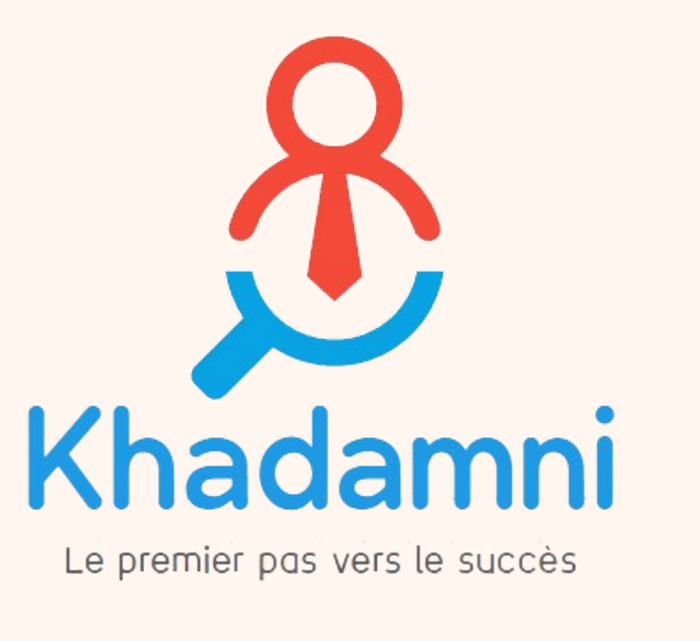

# Khadamni

### *Le premier pas vers le succès*

**A recruitment and jobs platform dedicated to computer science students.**
Find internships and jobs, take proficiency tests, attend events, and build your professional network, all in one place.

[🌐 www.khadamni.tn](https://www.khadamni.tn) · [📧 Contact](mailto:kadamni@gmail.com)

</div>

---

## 📣 Poster

<div align="center">

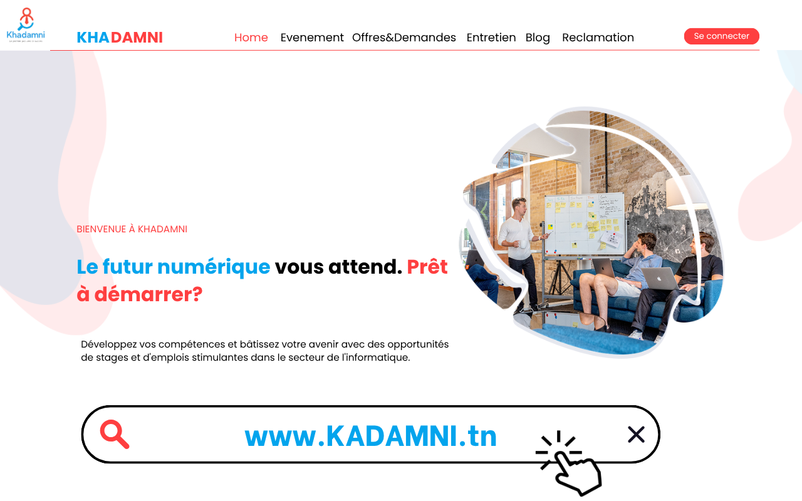

</div>

---

## 📖 Table of Contents

- [About the project](#-about-the-project)
- [Preview](#-preview)
- [Modules & features](#-modules--features)
- [Diagrams](#-diagrams)
- [Graphic charter](#-graphic-charter)
- [Getting started](#-getting-started)
- [Contact](#-contact)

---

## 🎯 About the project

**Theme:** Recruitment and jobs
**Subject:** Explore a new world of career possibilities with a dedicated platform for computer science students.

Khadamni is a website that makes it easier for computer science students to find jobs or internships, online or in person. It offers professional opportunities and a professional network, adapted to the digital market.

It goes beyond a simple job or internship search in IT: it aims to **empower students and foster their professional growth**.

### Who uses it?

The platform adapts the experience to the user's role, with specific access permissions for each:

| Role | What they can do |
|------|------------------|
| 🎓 **Student** | Build a CV, apply to offers, take tests, join events, post on the blog, file claims |
| 🏢 **Company** | Post job/internship offers, review applications, select candidates, schedule interviews |
| 🛠️ **Administrator** | Manage users, events, content and statistics from the back office |

---

## 🖼️ Preview

### Front office

<p align="center">
  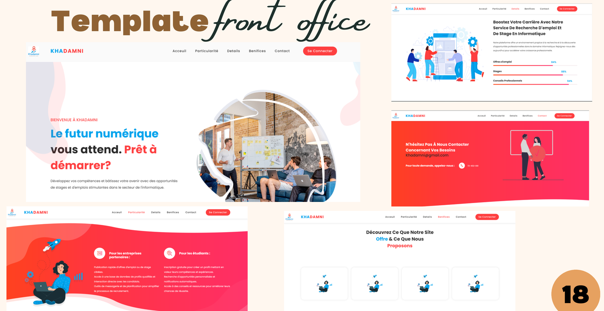
</p>

### Login

<p align="center">
  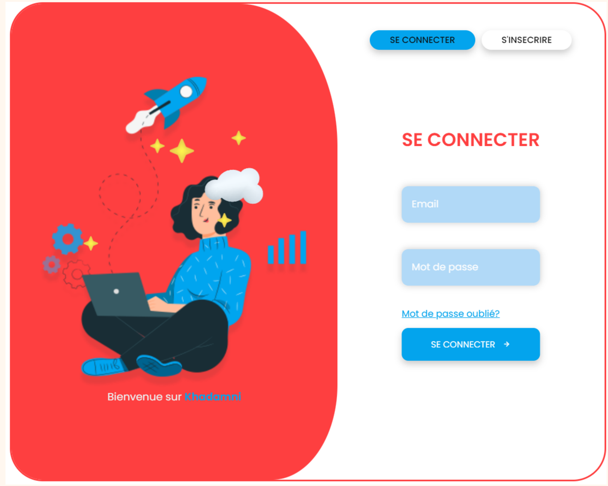
</p>

---

## 🧩 Modules & features

| # | Module | Description | Tables | Key features |
|---|--------|-------------|--------|--------------|
| 1 | **User management** | Role-based experience (administrator, student, company) with specific access permissions | `entreprise`, `étudiant`, `administrateur` | CRUD · Search · PDF export · Statistics · Forgot password · Session · Account blockage |
| 2 | **Event management** | Organize recruitment events: job fairs, webinars, networking sessions, training workshops | `catégorie`, `évènement`, `participation` | CRUD · Search · Notifications · Map |
| 3 | **Demand / Supply management** | Centralized platform where students apply online and companies post offers, review applications and select top candidates | `domaine`, `offre`, `demande` | CRUD · Search · Sort · Statistics · SMS · CV maker · Print CV |
| 4 | **Interview management** | Candidates complete a form and take a proficiency quiz; companies pick the best candidates for an in-person or online interview | `test`, `entretien` | CRUD · Search · Statistics · Quiz score · QR code · Export certificate |
| 5 | **Claims management** | Complaint handling to resolve user issues quickly and proactively | `réclamation`, `réponse` | CRUD · Search · Sort · Chatbot · Bad-words filter |
| 6 | **Blog management** | Publishing and management of articles, comments and tags | `blog`, `comment` | CRUD · Search · Sort · Like / Dislike · Statistics |

---

## 📐 Diagrams

- [Platform overview](#1-platform-overview)
- [Use cases by role](#2-use-cases-by-role)
- [Authentication flow](#3-authentication-flow)
- [Job application flow](#4-job-application-flow)
- [Interview & test flow](#5-interview--test-flow)
- [Event participation flow](#6-event-participation-flow)
- [Claims flow](#7-claims-flow)
- [Class diagram](#8-class-diagram)
- [Entity-relationship diagram](#9-entity-relationship-diagram)

### 1. Platform overview

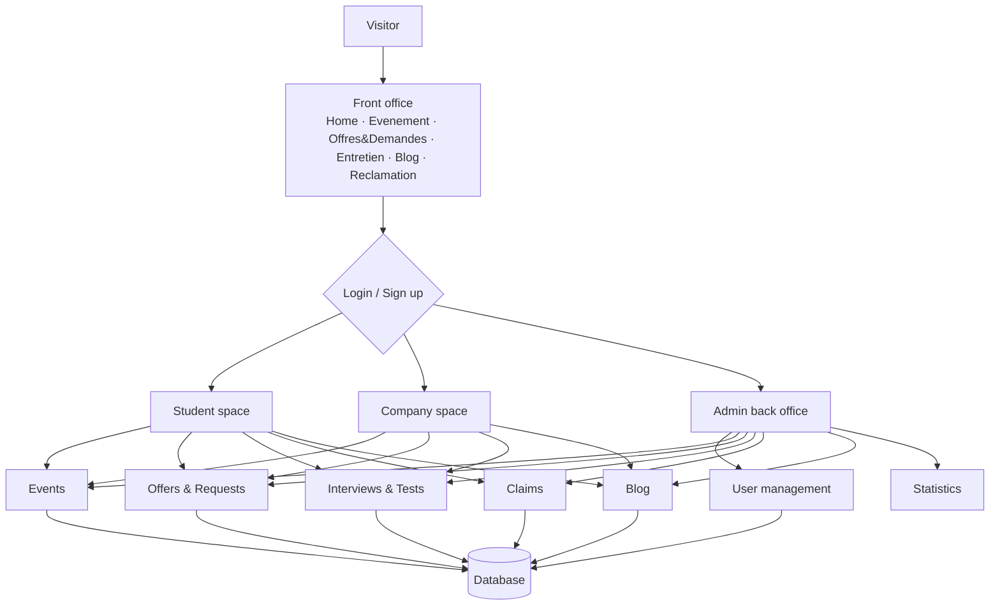

### 2. Use cases by role

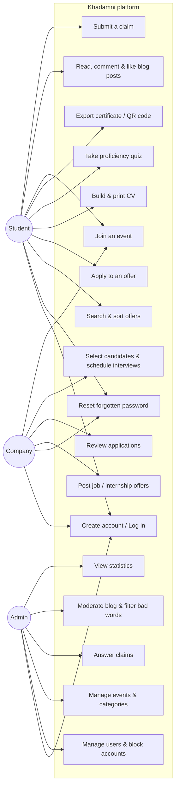

### 3. Authentication flow

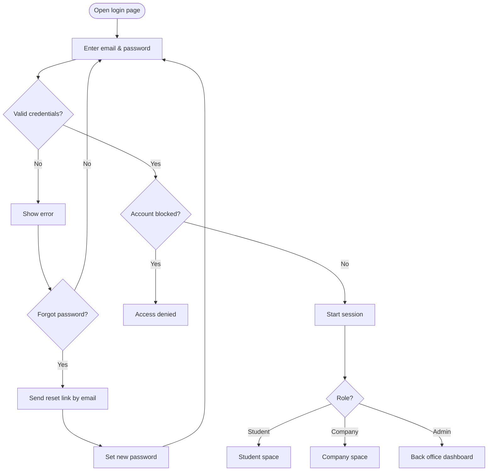

### 4. Job application flow

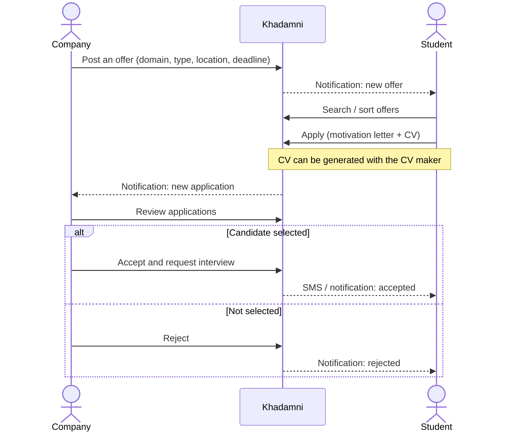

### 5. Interview & test flow

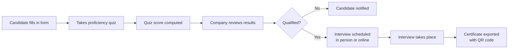

### 6. Event participation flow

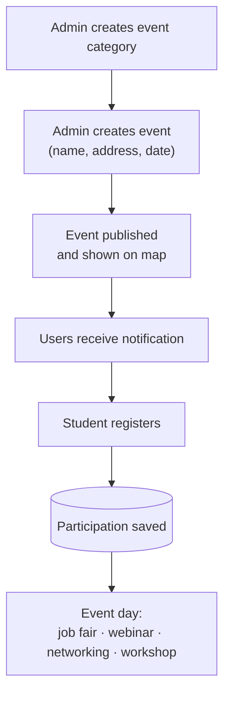

### 7. Claims flow

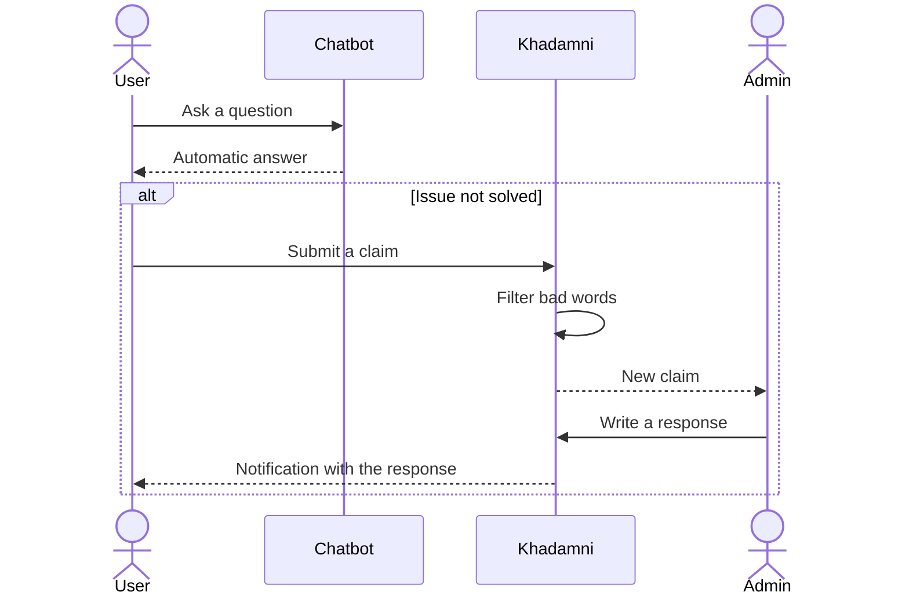

### 8. Class diagram

<p align="center">
  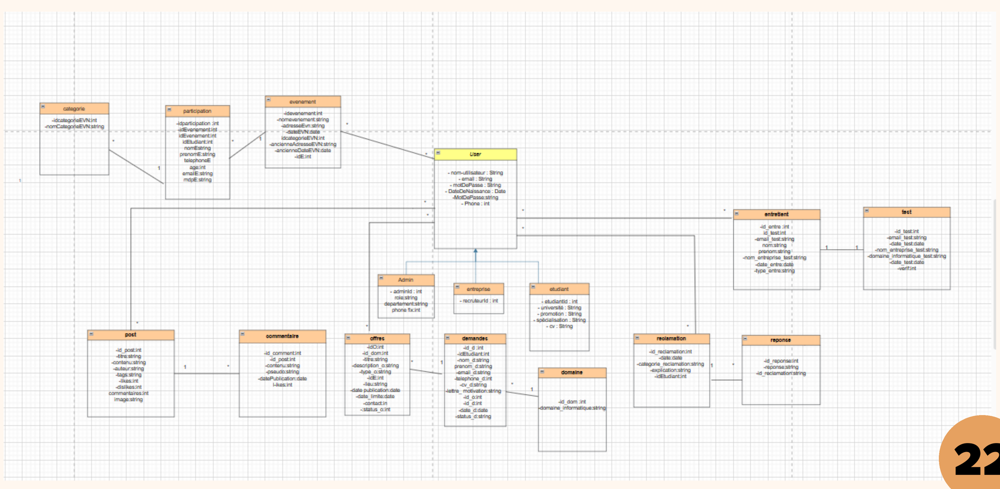
</p>

`User` is the parent class of `Admin`, `Entreprise` and `Etudiant`:

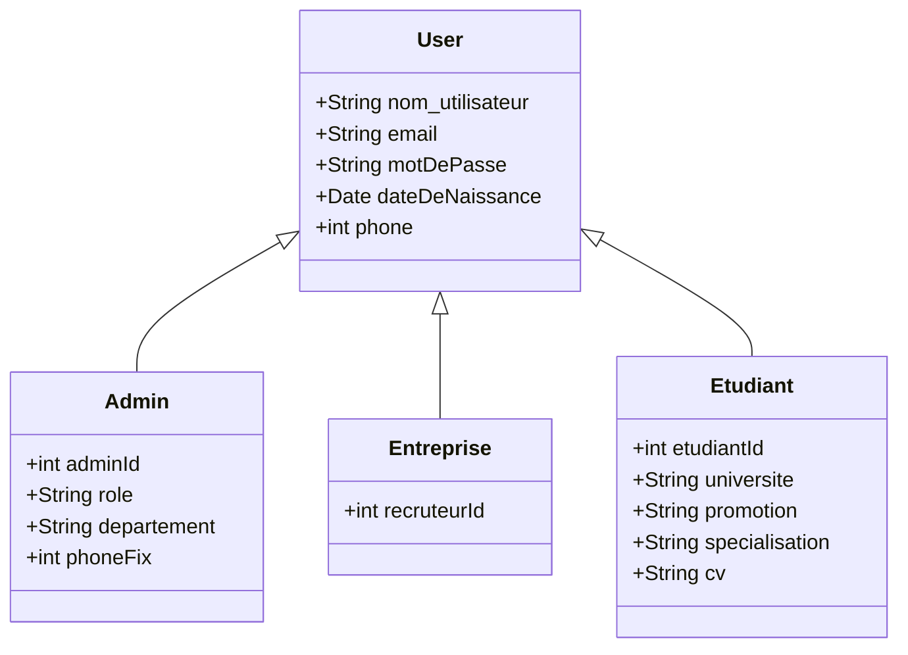

### 9. Entity-relationship diagram

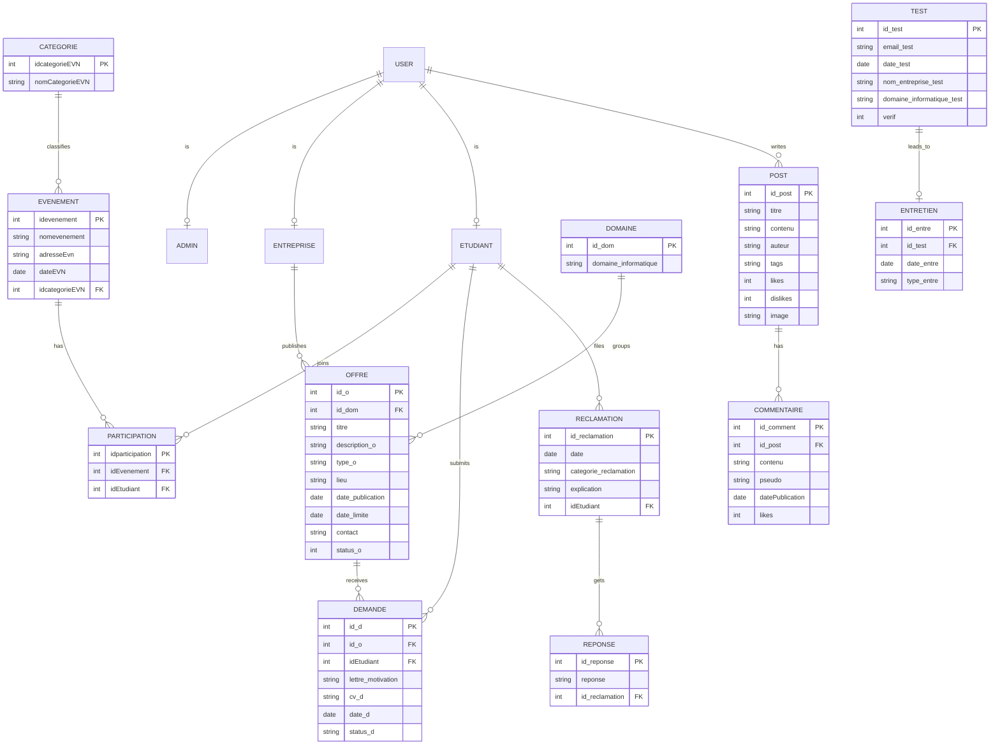

---

## 🎨 Graphic charter

| Element | Value |
|---------|-------|
| **Primary red** | Used for the "DAMNI" part of the logo, CTAs and accents |
| **Primary blue** | Used for the "KHA" part of the logo, highlights and links |
| **Typography** | Poppins |
| **Slogan** | *Le premier pas vers le succès* |

---

## 🚀 Getting started

<!-- TODO: adapt this section to your real stack and commands. -->

```bash
# 1. Clone the repository
git clone https://github.com/<your-username>/khadamni.git
cd khadamni

# 2. Install dependencies
# e.g. composer install / npm install

# 3. Configure your environment
cp .env.example .env

# 4. Set up the database
# e.g. php artisan migrate --seed

# 5. Run the project
# e.g. php artisan serve
```

---

## 📬 Contact

| | |
|---|---|
| 📞 Phone | +216 71001002 |
| 🌐 Website | [www.khadamni.tn](https://www.khadamni.tn) |
| 📧 Email | kadamni@gmail.com |
| 📱 Social | @khadamni |

---

<div align="center">

**Khadamni** · *Le premier pas vers le succès* 🚀

</div>
